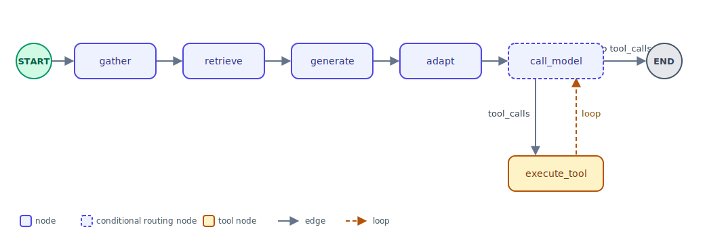

# Chapter 5: LangGraph — Stateful & Agentic Workflows

## Overview

A single LCEL chain is a straight line: prompt in, answer out. A real assistant needs branches — does the model want to call a tool, or just answer? — and state carried across multiple steps: a new hire's role, tasks, and current plan, threaded through gather, retrieve, generate, and adapt. LangGraph models that as a graph instead of nested conditionals bolted onto a chain. This chapter builds that graph, plus the tool-calling loop that lets the assistant act mid-conversation.

## State

Every node reads from and returns updates to one shared, typed state object.

```python
from typing import TypedDict
from langchain_core.messages import BaseMessage, AIMessage

class OnboardingState(TypedDict):
    user_id: str
    jwt: str
    role: str
    department: str
    question: str
    current_tasks: list[dict]
    retrieved_chunks: list[str]
    plan30Day: str
    plan60Day: str
    plan90Day: str
    messages: list[BaseMessage]      # conversation history sent to the model on each turn
    last_response: AIMessage         # the model's most recent response, read by the router and tool dispatch
    tool_result: dict | None
```

`messages` and `last_response` only matter once the graph includes the tool-calling loop later in this chapter — the gather → retrieve → generate → adapt pipeline above doesn't touch them. They're declared up front anyway because every node shares one state shape; a node that doesn't need a field simply doesn't read it.

## Graphs, Briefly

A graph is just a set of **nodes** (steps) connected by **edges** (which step runs next), instead of one straight line of code. LangGraph is that same idea, typed: nodes are functions, edges are the paths between them, and the graph itself decides which node runs next based on shared state.



The straight line across the top (`gather` → `retrieve` → `generate` → `adapt`) is a fixed sequence of edges — always the same next node. `call_model`, built later in this chapter, is different: its outgoing edge is conditional, branching to `execute_tool` or straight to `END` depending on the model's response, and `execute_tool` loops back to `call_model` so the model can react to a tool's result before deciding what to do next.

## Nodes

A node is a plain Python function: state in, a dict of updated fields out. Here's one node per step of the gather → retrieve → generate → adapt pipeline:

```python
async def gather_context(state: OnboardingState) -> dict:
    tasks = await fetch_tasks(state["user_id"], state["jwt"])
    return {"current_tasks": tasks}

async def retrieve_policy(state: OnboardingState) -> dict:
    chunks = await vector_store.asimilarity_search(state["question"], k=3)
    return {"retrieved_chunks": [c.page_content for c in chunks]}

async def generate_plan(state: OnboardingState) -> dict:
    result = await plan_chain.ainvoke({
        "role": state["role"],
        "department": state["department"],
        "context": state["retrieved_chunks"],
    })
    return {"plan30Day": result.plan30Day, "plan60Day": result.plan60Day, "plan90Day": result.plan90Day}

async def adapt_plan(state: OnboardingState) -> dict:
    updated = await adapt_chain.ainvoke({"current_tasks": state["current_tasks"], "plan30Day": state["plan30Day"]})
    return {"plan30Day": updated.plan30Day}
```

Each node returns only the keys it's changing — not the whole state object back.

## Building the Graph

```python
from langgraph.graph import StateGraph, END

graph = StateGraph(OnboardingState)
graph.add_node("gather", gather_context)
graph.add_node("retrieve", retrieve_policy)
graph.add_node("generate", generate_plan)
graph.add_node("adapt", adapt_plan)

graph.set_entry_point("gather")
graph.add_edge("gather", "retrieve")
graph.add_edge("retrieve", "generate")
graph.add_edge("generate", "adapt")
graph.add_edge("adapt", END)

onboarding_graph = graph.compile()
```

## Conditional Edges

A conditional edge routes based on the current state instead of always going to the same next node — this is how the assistant decides between "just answer" and "call a tool." The router function's return value is the name of the next node to run:

```python
def route_after_model(state: OnboardingState) -> str:
    if state["last_response"].tool_calls:
        return "execute_tool"
    return END

graph.add_conditional_edges("call_model", route_after_model, {"execute_tool": "execute_tool", END: END})
```

No tool call in the model's response means it's the final answer. One or more tool calls means route to a tool-execution node instead.

## Binding Tools to the Model

The model sees every available tool's schema on every turn and decides for itself whether plain text or a tool call is the right response — nothing here is wired to fixed keywords.

```python
from tools import manage_task, negotiate_plan, flag_for_manager_review

model_with_tools = llm.bind_tools([manage_task, negotiate_plan, flag_for_manager_review])

async def call_model(state: OnboardingState) -> dict:
    response = await model_with_tools.ainvoke(state["messages"])
    return {"last_response": response, "messages": state["messages"] + [response]}
```

## Reading and Dispatching a Tool Call

```python
async def execute_tool(state: OnboardingState) -> dict:
    tool_call = state["last_response"].tool_calls[0]
    tool = {"manage_task": manage_task, "negotiate_plan": negotiate_plan, "flag_for_manager_review": flag_for_manager_review}[tool_call["name"]]
    result = await tool.ainvoke({**tool_call["args"], "user_id": state["user_id"], "jwt": state["jwt"]})
    return {"tool_result": result}
```

`tool_call["name"]` and `tool_call["args"]` are the model's own interpretation of the conversation — the arguments are exactly as trustworthy as any other model output, which is why they get validated (a Pydantic model on the tool's parameters), not executed blind.

## Running the Graph

```python
final_state = await onboarding_graph.ainvoke({
    "user_id": user_id,
    "jwt": jwt,
    "role": role,
    "department": department,
    "question": question,
})
```

What comes back is the full final state — the generated plan, the retrieved chunks, whatever a tool wrote — not just a string.

## Scoping Tool Authority

`user_id` and `jwt` go into the initial state, not into the conversation text the model reads. A tool call built from `tool_call["args"]` never includes them — `execute_tool` injects them itself from state, so a tool can only ever act on the authenticated requester, regardless of who or what gets mentioned in the chat.

## Gotchas

- A node should return only the keys it's updating, not the whole state object — depending on the reducer configured for a given key, returning everything back can silently overwrite a field another node just set.
- A model choosing not to call a tool looks identical to it forgetting to: no error, just a plain-text response. The conditional edge is the only thing standing between "handled" and "silently should have acted but didn't."
- A tool's arguments come from the model's own read of the conversation, not from a client-validated form — validate them before acting, the same as any other untrusted input.
- A compiled graph with an unreachable node — nothing routes to it — can fail silently at build time in some versions instead of raising. Trace every edge back to the entry point by hand rather than assuming `.compile()` would have caught it.

## Quick Reference

```python
# State
class MyState(TypedDict):
    field: str

# Build
graph = StateGraph(MyState)
graph.add_node("name", node_fn)
graph.add_edge("from_node", "to_node")
graph.add_conditional_edges("node", router_fn, {"branch_a": "node_a", END: END})
graph.set_entry_point("first_node")
compiled = graph.compile()

# Tools
model_with_tools = llm.bind_tools([tool_a, tool_b])
response = await model_with_tools.ainvoke(messages)
response.tool_calls   # [{"name": ..., "args": {...}}, ...] or []

# Run
final_state = await compiled.ainvoke(initial_state)
```

## Coming Up

This graph is the inference server's core — `POST /plan` and `POST /plan/update` run the gather → retrieve → generate → adapt pipeline built above, and `POST /ask` routes into this same graph's tool-calling loop when a new hire asks the assistant to manage a task, negotiate a plan, or gets flagged as stuck.
